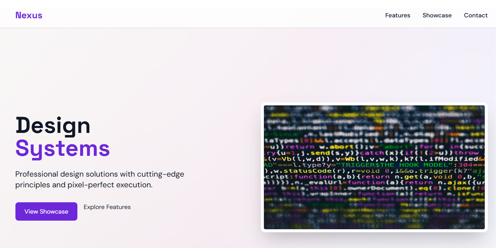

# Nexus Design - Modern Landing Page

A responsive landing page showcasing modern design principles with Tailwind CSS, featuring a mobile-friendly navigation system and smooth animations.

## Features

- **Responsive Design**: Fully optimized for mobile, tablet, and desktop
- **Modern UI**: Clean layout with attention to typography and spacing
- **Interactive Elements**:
  - Smooth scrolling navigation
  - Animated mobile menu
  - Scroll-triggered animations
- **Performance Optimized**:
  - Preloaded critical resources
  - Lazy-loaded images
  - Minimal JavaScript

## Technologies Used

- [Tailwind CSS](https://tailwindcss.com/) - Utility-first CSS framework
- [Intersection Observer API](https://developer.mozilla.org/en-US/docs/Web/API/Intersection_Observer_API) - For scroll animations
- [Google Fonts](https://fonts.google.com/) - Using Inter and Space Grotesk
- SVG - For all icons and illustrations

## File Structure
nexus-design/
├── index.html # Main HTML file
├── styles/
│ └── main.css # Custom styles
├── scripts/
│ ├── main.js # Core functionality
├── images/ # All visual assets
│ ├── icons/ # SVG icons
│ ├── hero/ # Hero images
│ └── showcase/ # Project showcase images

## Installation

1. Clone the repository:
git clone https://github.com/yourusername/nexus-design.git

2. Install dependencies:
cd nexus-design
npm install

3. Start development server:
npm run dev

Customization
Colors
Edit the Tailwind config in index.html:

tailwind.config = {
  theme: {
    extend: {
      colors: {
        primary: '#6D28D9',    // Purple
        secondary: '#059669',  // Emerald
        accent: '#EA580C'      // Orange
      }
    }
  }
}
Navigation
Update menu items in both sections:

Desktop:
<!-- Desktop Menu -->
<nav class="hidden md:flex space-x-8">
  <a href="#features">Features</a>
  <!-- Add more items -->
</nav>

Mobile:
<!-- Mobile Menu -->

  <a href="#features">Features</a>
  <!-- Mirror same items -->

Run HTML
Best Practices Implemented
✅ Semantic HTML5

✅ Accessible navigation (ARIA labels)

✅ Responsive images (srcset)

✅ CSS transitions for smooth animations

✅ JavaScript event delegation

✅ Mobile-first approach

License
MIT License - See LICENSE for details.
